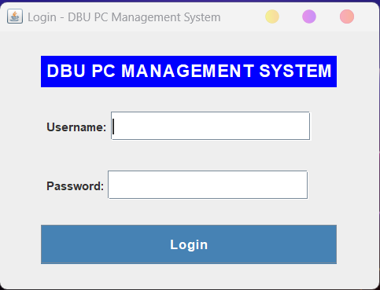
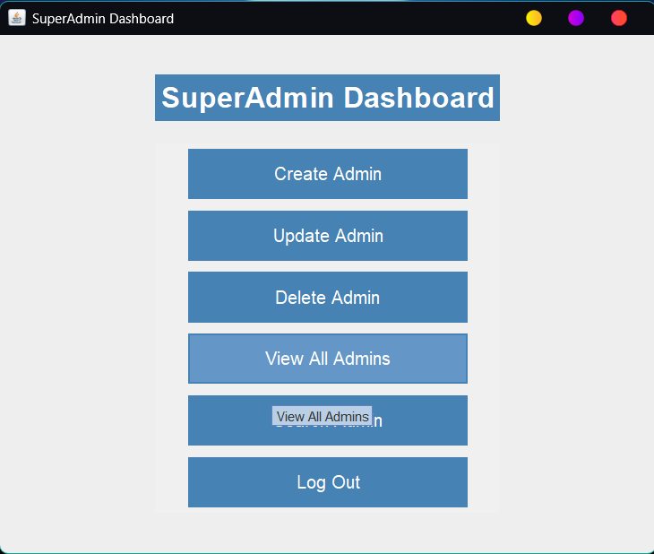
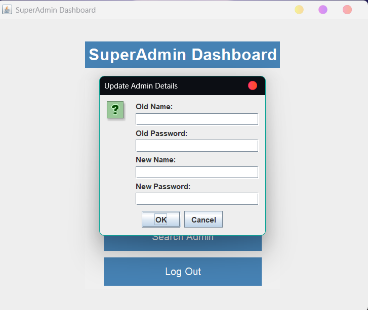
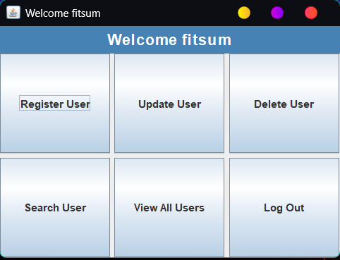
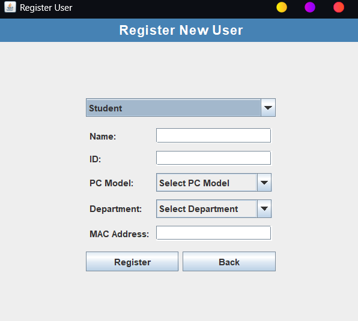
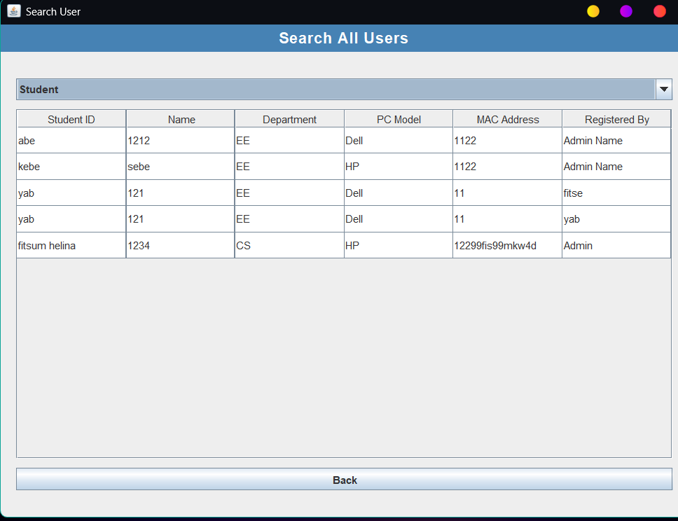

# 🚀 **PC Registration System** (Java-Based)  

📌 **A Java-based PC Registration System with GUI & File-Based Storage**  

---  

## 📖 **Project Overview**  

The **PC Registration System** is a **Java-based** application designed to manage **student and staff registrations**. It features **role-based access**, where a **Super Admin** manages **Admins**, and Admins handle **students & staff**.  

The system is built using **Java Swing for GUI**, follows **OOP principles**, and uses **file-based storage** for data persistence.  

---

## 🎯 **Key Features**  

🔹 **Super Admin:**  
✅ Secure login authentication  
✅ Manage Admins (**Create, Update, Delete, Display, Search**)  

🔹 **Admin:**  
✅ Secure login authentication  
✅ Manage Students & Staff (**Create, Update, Delete, Display, Search**)  

🔹 **Student & Staff:**  
✅ CRUD operations performed by Admins  
✅ Data stored in `student.txt` & `staff.txt`  

🔹 **File-Based Data Storage:**  
✅ Uses simple `.txt` files (`admin.txt`, `student.txt`, `staff.txt`) for lightweight data handling  

🔹 **Service Layer:**  
✅ Handles all business logic (**AdminService, StudentService, StaffService**)  

🔹 **File Management System:**  
✅ Reads/Writes data via `FileManager.java`  

---
## Project Overview

<div align="center">
  <table>
    <tr>
      <td></td>
      <td></td>
      <td></td>
    </tr>
    <tr>
      <td></td>
      <td></td>
      <td></td>
    </tr>
  </table>
</div>


---
## 🏗 **Project Structure**  

```plaintext
src/
│
├── gui/                 # Graphical User Interface (Swing-based)
│   ├── LoginFrame.java
│   ├── SuperAdminFrame.java
│   ├── AdminFrame.java
│   ├── RegisterUserFrame.java
│   ├── DeleteUserFrame.java
│   ├── SearchUserFrame.java
│   ├── UpdateUserFrame.java
│   ├── ViewAllUsersFrame.java
│  
├── model/               # Entity Models
│   ├── Admin.java
│   ├── Student.java
│   ├── Staff.java
│
├── service/             # Business Logic (CRUD Operations)
│   ├── AdminService.java
│   ├── StudentService.java
│   ├── StaffService.java
│
├── utils/               # Utility Functions
│   ├── FileManager.java
│
└── data/                # File-Based Storage
    ├── admin.txt
    ├── student.txt
    ├── staff.txt
    ├── superadmin.txt
```

---

## 🚀 **Getting Started**  

### **1️⃣ Clone the Repository**  

```bash
git clone https://github.com/Fitsumhelina/pc-registration-system.git
```

### **2️⃣ Navigate to the Project Directory**  

```bash
cd src
```

### **3️⃣ Setup Login Credentials**  

1. Navigate to `src/data/`  
2. Create a **`superadmin.txt`** file  
3. Add the **Super Admin's credentials**:  

```plaintext
yourUsername,yourPassword
```

### **4️⃣ Open in Your Preferred IDE**  

📌 **Compatible with:**  
✅ IntelliJ IDEA  
✅ Eclipse  
✅ VS Code (Install [Java Extension Pack](https://code.visualstudio.com/docs/java/java-tutorial))  

### **5️⃣ Compile & Run the Project**  

To compile the files, follow this order:  
📌 **Models → Utils → Services → GUI → `App.java`**  

```bash
javac App.java
java App
```

### **6️⃣ Login & Start Managing Users**  

- **Super Admin logs in** using the credentials in `superadmin.txt`  
- **Super Admin manages Admins** (CRUD operations)  
- **Admins manage Students & Staff** (CRUD operations)  

---

## 🔧 **System Functionalities**  

### **👑 Super Admin Functions**  

✅ **Create Admins**  
✅ **Update Admins**  
✅ **Delete Admins**  
✅ **Search Admins**  
✅ **View All Admins**  

📌 **Admin Data is stored in** → `admin.txt`  

---

### **🛠 Admin Functions**  

✅ **Create Students & Staff**  
✅ **Update Student & Staff Records**  
✅ **Delete Student & Staff Records**  
✅ **Search for Students & Staff**  
✅ **View All Students & Staff**  

📌 **Student Data is stored in** → `student.txt`  
📌 **Staff Data is stored in** → `staff.txt`  

---

## 📂 **File Storage & Management**  

🔹 **Admin Data:** Stored in `admin.txt`  
🔹 **Student Data:** Stored in `student.txt`  
🔹 **Staff Data:** Stored in `staff.txt`  

📌 **File operations are managed by:** `FileManager.java`  

```java
// Read Data from a File
FileManager.read("admin.txt");

// Write Data to a File
FileManager.write("New Admin Record", "admin.txt");
```

---

## 🔐 **Security Measures**  

✅ **Username & Password Authentication** for login  
✅ **Admins & Super Admins have role-based access control**  
✅ **Data integrity maintained through file-based storage**  

---

## 🛠 **CRUD Operations Overview**  

### **📝 Create**  
```java
AdminService.createAdmin(new Admin("admin1", "password123"));
StudentService.createStudent(new Student("John Doe", "1234"));
StaffService.createStaff(new Staff("Jane Doe", "5678"));
```

### **🔍 Read / Display**  
```java
List<Admin> admins = AdminService.getAdmins();
List<Student> students = StudentService.getStudents();
List<Staff> staff = StaffService.getStaff();
```

### **✏️ Update**  
```java
AdminService.updateAdmin("admin1", new Admin("admin1", "newpassword"));
StudentService.updateStudent("1234", new Student("John Doe", "5678"));
StaffService.updateStaff("5678", new Staff("Jane Doe", "91011"));
```

### **🗑 Delete**  
```java
AdminService.deleteAdmin("admin1");
StudentService.deleteStudent("1234");
StaffService.deleteStaff("5678");
```

---

## 💡 **Why Choose This System?**  

✅ **Lightweight & Fast** → Uses file-based storage (No need for databases)  
✅ **User-Friendly** → Simple **Java Swing GUI**  
✅ **Secure** → Role-based login system  
✅ **Easy to Maintain** → **Object-Oriented & Modular Code**  

---

## 💻 **Technologies Used**  

🚀 **Programming Language:** Java  
📁 **Data Storage:** File-based storage (`.txt` files)  
🖥 **GUI Framework:** Java Swing  
🛠 **Development Tools:** IntelliJ IDEA, VS Code  

---

## 📌 **Future Improvements**  

🔹 **Switch from text files to a database (MySQL/PostgreSQL)**  
🔹 **Implement password encryption for stronger security**  
🔹 **Add logging system for tracking admin activities**  
🔹 **Enhance GUI with a more modern UI design**  

---

## 📩 **Contact & Contribution**  

💡 **Want to contribute?**  
Feel free to **fork the repo**, create a **pull request**, or **open an issue**!  

📧 **For any inquiries, reach out via [linkedin](https://www.linkedin.com/in/fitsumhelina/)!**  

